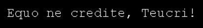
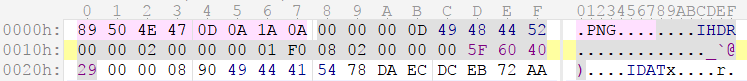
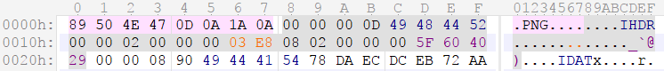
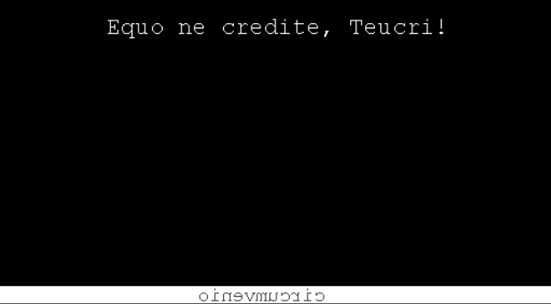

We begin by checking the file type:
```
→  file small_ancient_box
small_ancient_box: UHarc archive data
```
I extracted it using [WinUha](http://www.winuha.com/) on Windows, as there seems to be no native Linux/OSX tool to do this job.

Inside we find a file named `262144`:
```
→  file 262144
262144: PNG image data, 512 x 496, 8-bit/color RGB, non-interlaced
```

We append its `.png` extension and open the image. Printed inside we see:



Translated from Latin it means:
```
Do not trust the horse, Teurcri!
```

Indeed, a clear hint that something is hidden in this image. We could approach it in a number of ways, but for the sake of simplicity, let's use `zsteg`:
```
→  zsteg -v 262144.png
extradata:imagedata ..

    00000000: 01 ff ff ff 00 00 00 00  00 00 00 00 00 00 00 00  |................|
    00000010: 00 00 00 00 00 00 00 00  00 00 00 00 00 00 00 00  |................|
    *
    00000100:
meta >>             .. text: "N3q8ryccAASnA94DoAAAAAAAAAAnAAAAAAAAAFvjtabQ0nDaVSgcVjJd0LX7i6R1gEL9GXJNBw8SNHpoQumLZdkK6xWzB9n3dG6WQLdF/VRQmvdpTSaAqmMsXQpllLGjP31CsKG3HMTKNupuktsjJS12Py4tOrSGPZHSDsGZjbLoF/cTRrggCN81oYW66N7cl50x/lM+2qmSvw59I82KZhNeTOWvDKurl4ll0toGUmsRONPw2LYkBO2WRcE9pBsCFwYgAQmAgAAHCwEAASQG8QcBClMHhKmf8G2NEEUMcgoBZnPbLwAA"
```

Two things grab our attention: **extra image data**, and **EXIF metadata**. 
We decode the latter using **Base64**:
```
→  echo "N3q8ryccAASnA94DoAAAAAAAAAAnAAAAAAAAAFvjtabQ0nDaVSgcVjJd0LX7i6R1gEL9GXJNBw8SNHpoQumLZdkK6xWzB9n3dG6WQLdF/VRQmvdpTSaAqmMsXQpllLGjP31CsKG3HMTKNupuktsjJS12Py4tOrSGPZHSDsGZjbLoF/cTRrggCN81oYW66N7cl50x/lM+2qmSvw59I82KZhNeTOWvDKurl4ll0toGUmsRONPw2LYkBO2WRcE9pBsCFwYgAQmAgAAHCwEAASQG8QcBClMHhKmf8G2NEEUMcgoBZnPbLwAA" \
| base64 --decode > decoded

→  file decoded
decoded: 7-zip archive data, version 0.4
```

A **7-ZIP** archive! Unfortunately, it is password-protected, so we have to go back to our image.

We know that there are extra pixels left unused with the current dimensions. This means that either the width **512** or height **496** is incorrect. We now have a choice - calculate the correct size, or artificially increase the dimensions in hopes to reveal something. It so happens that the lazy approach works here, but for a more robust method, please refer to the [extended solution](SOLUTION_EX1.md).

Due to the way **PNG image data** is stored, changing the **width** will cause all pixel rows to be cut, effectively destroying the image. If we increase the **height**, however, we will only force those extra pixels to appear. To do so, we have to patch the **IHDR chunk's height field**. I recommend using [010 Editor](https://www.sweetscape.com/010editor/), since it supports file format templates, but we could also do it manually. 

Looking at the [PNG format specifications](https://raw.githubusercontent.com/corkami/pics/master/binary/PNG.png), we see that the height is a **4-byte** value stored at the file offset `14h`, or `0x14`:



Simply change the value to `00 00 03 E8` (1000 pixels):



Saving and opening the new image, we are now revealed a white bar on the bottom, with some text inside:



By flipping it horizontally we end up with the word `circumvenio`

Well, we still have the **7-ZIP** archive, so we use this word to extract it. Finally, we are greeted with a text file `well_done.txt`. Inside it is the password for the next level: `quotcapitatotsensus`
