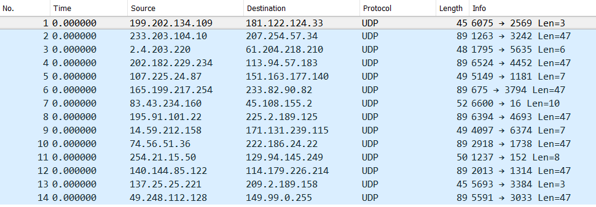
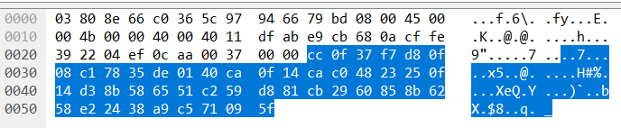
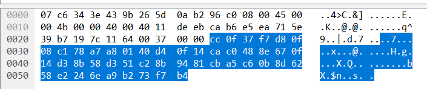

We begin by extracting the archive:
```
→  unzip arcane_item.zip
Archive:  arcane_item.zip
 extracting: arcane_item
```

We then check the type of the new file:
```
→  file arcane_item
arcane_item: bzip2 compressed data, block size = 900k
```

Another round of decompression:
```
→  bunzip2 arcane_item
bunzip2: Can't guess original name for arcane_item -- using arcane_item.out
```

Check file type again:
```
→  file arcane_item.out
arcane_item.out: tcpdump capture file (little-endian) - version 2.4 (Ethernet, capture length 65535)
```

And we get a **TCPDump**. We load up [WireShark](https://www.wireshark.org/) and open the dump file. We see the following:



Checking the **data frame** of each packet, we quickly notice that every other packet, starting from the first one, contains a readable word. We write them all down and get:
```
x86 primus littera reuocandum machina detegere x86
```

A Google Translate of the Latin words reveals:
```
the first letter mnemonic machine run
```

So we are looking for x86 bytecode and mnemonics formed from first letters. We take a look at the data of the non-readable packets (highlighted in blue):




The data seems to follow some structure, since many of the bytes don't change. Their length is also exactly 47 bytes long. Without any better ideas, we attempt to [disassemble the bytes as x86 instructions](https://defuse.ca/online-x86-assembler.htm): 
```
0:  cc                      int3
1:  0f 37                   getsec
3:  f7 d8                   neg    eax
5:  0f 08                   invd
7:  c1 78 35 de             sar    DWORD PTR [eax+0x35],0xde
b:  01 40 ca                add    DWORD PTR [eax-0x36],eax
e:  0f 14 ca                unpcklps xmm1,xmm2
11: c0 48 23 25             ror    BYTE PTR [eax+0x23],0x25
15: 0f 14 d3                unpcklps xmm2,xmm3
18: 8b 58 65                mov    ebx,DWORD PTR [eax+0x65]
1b: 51                      push   ecx
1c: c2 59 d8                ret    0xd859
1f: 81 cb 29 60 85 8b       or     ebx,0x8b856029
25: 62 58 e2                bound  ebx,QWORD PTR [eax-0x1e]
28: 24 38                   and    al,0x38
2a: a9 c5 71 09 5f          test   eax,0x5f0971c5
```

Due to the aforementioned 'structure', disassembling any of the data bytes will output the same instructions, just with different numbers. Could these instructions be useful then? We know that 'mnemonics' are formed from the first letters of words, so we take the first letter of each instruction and get:
```
ignisaurumprobat
```

"Fire tests the gold". The password for this level is: `ignisaurumprobat`
