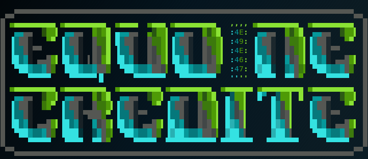

# Avast Challenge, Hack Cambridge 2018 : WRITE-UP

[Level 1](Level%201) | [Level 2](Level%202) | [Level 3](Level%203) | [Level 4](Level%204) | [Level 5](Level%205) | [Story pages](Story%20pages)

## Intro
The Avast challenge was a Roman-themed CTF open to all participants in Hack Cambridge 2018. For 24 hours we had to solve all 5 levels and the first team to make it was proclaimed the winner.

## Story
I couldn't miss the Avast stand, who were giving away mysterious flash drives with a secret challenge. Come on, who could resist? I happily devoted my second half of the day exclusively to this puzzle.

TL;DR: It was tough. The challenge covered a large variety of topics, some of which I had no experience in. Despite that, it was probably the most entertainable puzzle I have ever solved. I couldn't finish all of the levels on-site, but I took them as homework and over the next week completed the challenge. It was an incredible experience and I learned so much that I could not have learned otherwise. Props to level 1 and 5 for keeping me busy for a lot longer than I would like to admit. Often times the hardest part is looking at things simply, without overcomplicating what is supposed to be mainstream.
